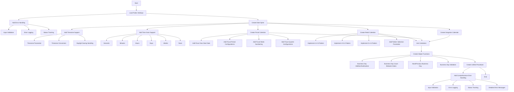

# Snowflake Calendar Implementation Plan

## Overview
This document outlines the implementation plan for creating a comprehensive calendar system in Snowflake, tailored for Australian use cases. The system will include multiple calendar types, timezone support, and helper functions for business day calculations.

## Architecture Diagram

## Key Components

### 1. Public Holidays
- Load from data.gov.au
- Comprehensive error handling
- Status tracking

### 2. Date Spine
- Timezone support
- Multiple time grains (seconds to years)
- Daylight saving handling

### 3. Calendar Types
- Gregorian Calendar
- Fiscal Calendar (custom start date, periods, quarters)
- Retail Calendar (4-4-5, 4-5-4, 5-4-4 patterns)

### 4. Helper Functions
- Business day calculations
- Date validation
- Next/previous business day

### 5. Unified Procedure
- Single entry point for calendar setup
- Comprehensive error handling
- Detailed logging

## Next Steps
1. Review and confirm the plan
2. Switch to Code mode for implementation
3. Begin with core date spine functionality